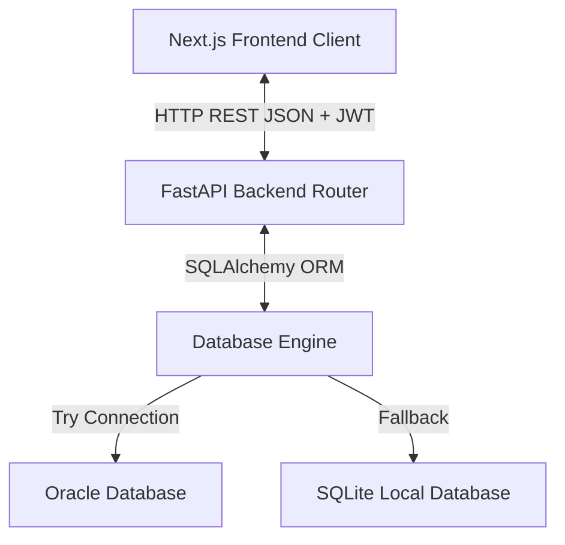

# LUCE Core Banking & Wallet System Documentation

Welcome to the comprehensive documentation of the **LUCE Core Banking and Retail Wallet Application**. This document explains the full system architecture, database design, error handling policies, interactive buttons/routes, security audit trails, and notification systems.

---

## 1. System Architecture

LUCE is built using a modern decoupled client-server architecture:



### Components:
1. **Frontend**: Next.js (React) App Router styled with glassmorphism, responsive grid, dynamic gradient rings, and smooth micro-interactions.
2. **Backend**: Python FastAPI providing async endpoint routers, secured via JSON Web Tokens (JWT) using HS256 algorithm.
3. **Database**: Resilient SQLAlchemy database connection logic that tests connections to an Oracle instance (configured in `.env`) and automatically falls back to SQLite (`bank.db`) in local development environments.

---

## 2. Configuration & Connections

### Frontend Configurations
- Located in `frontend/.env.local`:
  ```ini
  NEXT_PUBLIC_API_BASE_URL=http://localhost:8000/api
  ```
- Uses `src/lib/api.ts` to perform all `fetch` request headers, inject bearer JWTs dynamically, and check for `401 Unauthorized` responses to clear invalid/stale logins.

### Backend Configurations
- Environment configs are managed in `backend/.env` and parsed by `backend/config.py`:
  - **Database Connection**: Configured for Oracle DSN connection strings. If not resolved, defaults to SQLite `sqlite:///./bank.db`.
  - **Security Settings**: `SECRET_KEY` for cryptographically signing JWT tokens, and token expiration timings.
  - **CORS Setup**: Restricts incoming API requests to authorized origins: `http://localhost:3000`, `http://localhost:3001`, and their `127.0.0.1` equivalents.

---

## 3. Database Schema

The database models are designed using SQLAlchemy ORM (see [backend/models/](file:///c:/Users/Hp/bank/backend/models/)):

| Table Name | Class Name | Primary Key | Description |
|---|---|---|---|
| `users` | `User` | `user_id` | Authentication record (email, password hash, and system role: `CUSTOMER` or `ADMIN`). |
| `customers` | `Customer` | `customer_id` | Profile details (name, phone, address, date of birth, and `gender` string). |
| `accounts` | `Account` | `account_id` | Bank accounts (type: `SAVINGS` or `CURRENT`, 10-digit NUBAN account number, currency, status, balance). |
| `transactions`| `Transaction` | `transaction_id` | Double-entry ledger records (DEPOSIT, WITHDRAWAL, TRANSFER, amount, reference, description). |
| `cards` | `Card` | `card_id` | Debit cards (Visa/Mastercard, 16-digit card number, CVV, expiry date, status). |
| `loans` | `Loan` | `loan_id` | Loan accounts (amount, interest rate, term, status: PENDING/APPROVED, and approver employee ID). |
| `audit_logs` | `AuditLog` | `audit_id` | System audit ledger (records action types, target entity, timestamp, and initiator user ID). |
| `notifications`| `Notification`| `notification_id`| Customer inbox notices (title, message body, status: UNREAD/READ). |

---

## 4. Error & Exception Handling

Robust exception handling ensures the system remains resilient and type-safe:

### Backend Layer
1. **Type Safety & Precision**: High-precision money transactions are type-cast from `float` payload parameters into Python `Decimal` values before comparison against account balances. This prevents floating-point inaccuracies and resolves runtime `TypeError` crashes during account balance checks.
2. **FastAPI Route Validation**: Pydantic validates payload schemas at input gates. Custom HTTP exceptions are raised with clear detail messages (e.g. `HTTP 401 Unauthorized` for incorrect credentials, `HTTP 403 Forbidden` for permissions).
3. **Database Failures**: Service commits are wrapped inside `try...except` blocks with database `db.rollback()` triggers on database integrity constraints or constraint violations.

### Frontend Layer
1. **Error Parser**: `formatApiError()` in `api.ts` parses FastAPI error lists or custom error structures into user-friendly diagnostic alert banners.
2. **Session Intercept**: If the server returns a `401 Unauthorized` status (due to token expiration), the frontend automatically logs out the user and routes them back to `/login` to prevent broken states.

---

## 5. Interactive UI Elements & Buttons

Every visual control is fully wired to dynamic state changes and API actions:

- **Scan QR Code (Header)**: Triggers an overlay modal. It requests `/api/accounts/me/qrcode` to display the customer's own QR code (generated dynamically as a base64 PNG in the backend via the `qrcode` library).
- **Notification Bell (Header)**: Displays a counter badge indicating unread notifications. Clicking it opens a dropdown panel containing unread messages. Clicking a notification marks it as `READ` on the backend.
- **Settings Gear (Header)**: Positioned next to the notification bell, replacing the initials circle. Displays system control prompts.
- **Dynamic Gender Avatars (Dashboard)**: The greeting section next to the greeting banner ("Good morning...") renders a detailed male or female SVG avatar based on the logged-in customer's `gender` field, falling back to initials if unread.
- **Sticky Footer Nav (Mobile)**: Anchors at the bottom of the viewport on mobile devices. Page wrappers use custom bottom margin classes to ensure scrollable lists or submit buttons are never blocked by the bottom navigation bar.

---

## 6. Audit Trail & Security Logs

Every write action generates a persistent security ledger record in `audit_logs`:

```
User Action  --->  Route Handler  --->  AuditService.log()  --->  Saved in DB
```

### Logged Operations:
- **Authentication**: `REGISTER` (log new signups) and `LOGIN` (successful credentials matches).
- **Accounts**: `CREATE_ACCOUNT` (record customer account setup).
- **Transactions**: `DEPOSIT`, `WITHDRAWAL`, and `TRANSFER` (track moving money, including sender/receiver NUBANs).
- **Cards**: `ISSUE_CARD` (track issuing virtual cards).
- **Loans**: `REQUEST_LOAN` (record new requests) and `APPROVE_LOAN` (record staff approvals).

### Admin Logs Viewer
Administrators with the `ADMIN` role can access the page [Audit Logs](file:///c:/Users/Hp/bank/frontend/src/app/admin/audit/page.tsx) directly from the header navigation. This page queries `/api/audit/` and features search filters for Actions, Entities, and Descriptions. Non-admin users are automatically redirected to protect audit log security.
